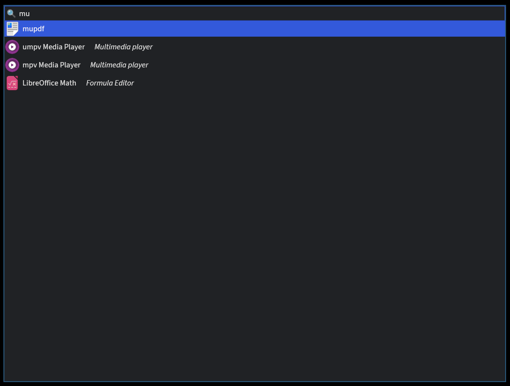

# Overview
- [📦 crates.io](https://crates.io/crates/lap)
- [⚖ 0BSD license](https://spdx.org/licenses/0BSD.html)

Application launcher for Linux

This scans for XDG desktop files and opens up a searchable list to launch the desired program.

Wayland is supported. X11 should work too, though this has not been tested.



# Usage
When the GUI has focus, the following controls are available:
- `Enter`: Launch selected app.
- `Esc` (twice): Exit launcher.
- `Up`: Select previous suggestion.
- `Down`: Select next suggestion.

# Configuration
`$XDG_CONFIG_HOME/lap/settings.toml` is the configuration file. Available settings are described
below with example values.

```toml
# Font to use
# Default: None
font = "Source Sans 3"

# Whether the window should be resizable.
# Setting this to false may make the window float if using a tiling window manager.
# Default: false
resizable = false

# Name of the icon theme to use for app icons
# Default: None
icon-theme = "Papirus-Dark"

# Icon size in pixels
# Default: 16
icon-size = 16

# Maximum string distance between search pattern and suggestion. Suggestions with a greater distance
# are filtered out. The distance is in [0, 1].
# Default: 0.4
max-distance = 0.4

# GUI theme
# The `list-themes` subcommand lists available themes.
# Default: "Dark"
theme = "Dark"
```

# Contribute
All contributions shall be licensed under the [0BSD license](https://spdx.org/licenses/0BSD.html).
